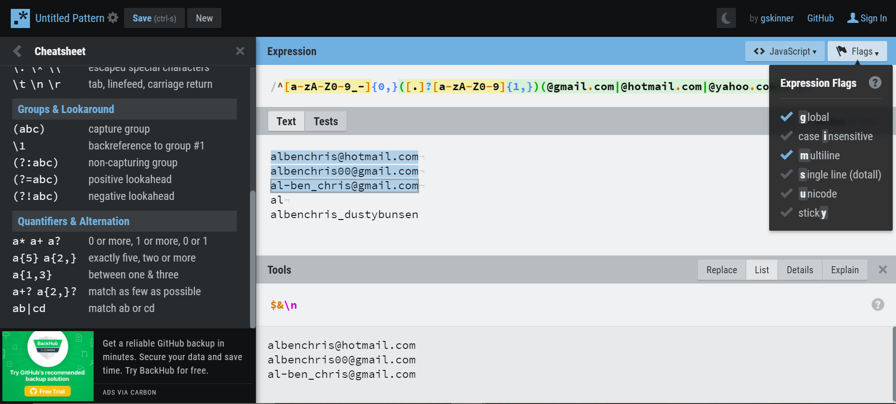

# **Email RegEx Tutorial**

RegEx (Regular Expressions) can be one of the many steps apps take to validate information users are entering into the database. At first glance, they may look like a toddler got a hold of a keyboard, but there is a method to the expressions that can be easy to understand with the right resources along with some practice.

## **Summary**

In this tutorial, we will be looking at regex expressions that validate emails. 

These could look like:
* /([a-z0-9_.-]+)@([\da-z.-]+).([a-z]{2,3})/
* /^\w+([\.-]?\w+)*@\w+([\.-]?\w+)*(\.\w{2,3})+$/
* /^[a-zA-Z0-9_-]{0,}([.]?[a-zA-Z0-9]{1,})@(gmail|hotmail|yahoo).com$/gm

If interested in testing these out, check out [regexr.com](https://regexr.com/). This is a great tool for testing out regex in real time. It comes with a very helpful cheatsheet! If testing multiple examples like this image, checking the "global" and "multiline" flags and selecting the "List" tool is recommended.

## **Table of Contents**

- [Anchors](#anchors)
- [Quantifiers](#quantifiers)
- [OR Operator](#or-operator)
- [Character Classes](#character-classes)
- [Flags](#flags)
- [Grouping and Capturing](#grouping-and-capturing)
- [Bracket Expressions](#bracket-expressions)
- [Greedy and Lazy Match](#greedy-and-lazy-match)
- [Boundaries](#boundaries)
- [Back-references](#back-references)
- [Look-ahead and Look-behind](#look-ahead-and-look-behind)

*****

## **Regex Components**

*****

### **Anchors**
**^ ?**

"^" At the start (Example: ^hot will match any string that starts with "hot")

"$" At the end (Example: mail$ will match any string that ends with "mail". This could include "hotmail" or "gmail", etc.)

**In the second example in the summary**
* /^\w+([\.-]?\w+)*@\w+([\.-]?\w+)*(\.\w{2,3})+$/

The "^" requires a word to follow signified by the "\w"

The "$" at the end requires one or more "(\.\w{2,3})" which is a grouping that would include something like ".com", ".org" or ".co"; the "+" following the group in parenthesis is a quantifier and will be covered in that section.

**In the third example in the summary**
* /^[a-zA-Z0-9_-]{0,}([.]?[a-zA-Z0-9]{1,})@(gmail|hotmail|yahoo).com$/gm

We use the "$" to be extra specific requiring the user to have a gmail, hotmail or yahoo email account.

*****

### **Quantifiers**
**\* + ? {}**

"*" Will match zero or more of the preceding value. "{0,}" Will do the same, so these values are interchangeable. For example "com{0,}" will match a string that has "co" followed by zero or more "m". If we were to remove the comma, "com{0}", this would contradict the "m" and would only match "co". So the comma is the "or more" expression here.

"+" Will match one or more of the preceding value. "{1,}" Is interchangable in this case. For example "com+" or "com{1,}" would match "com", "comm" or even "commmmmmm", but not "co".

"?" or "{0,1}" Will match zero or one of the preceding value. "com?" Would match either "com" or "co", but not "commm" in this case.

**We use a combination of all of these in the summary codes, but here are a couple key examples
* "([a-z]{2,3})" will match lowercase strings like "com", "co", "org" and "net", but not "c" or "nett"
* "\w+" will match lowercase letters with one or more lowercase letters after

*****

### **OR Operator**
**| []**

"|" Is the expression for "or". We used it in the third summary example:
* /^[a-zA-Z0-9_-]{0,}([.]?[a-zA-Z0-9]{1,})@(gmail|hotmail|yahoo).com$/gm

Here "(gmail|hotmail|yahoo)" matches a user's gmail, hotmail, or yahoo account

"[]" Is another expression for "or", it surrounds the accepted values and works well with quantifiers. For example, if a user's email can contain lowercase letters and numbers, the expression would be: 
* /[a-z0-9]+/

This would be one character "a" through "z" OR "0" through "9". The "+" would look for this to happen one or more times. Accepted strings would be "albenchris", "albenchris00" or "alb3nchri5". It would not accept "AlBenChris" unless we put an "A-Z" uppercase value inside the brackets.

*****

### **Character Classes**
**\d \w \s**

"\d" Will match a single digit character. This is interchangeable with "0-9". "\D" Is the inverse of this and will match any letter or special character like "!".

"\w" Will match a single word character. This is interchangeable with "[a-zA-Z]". "\W" Is the inverse of this, matching any character that is not "a-z" or "A-Z", like "0-9" or special characters like "!".

"\s" Will match any white space. We won't use this for checking emails, however the "\S" will negate the white space, which could be useful. For example "\S{0,}@gmail.com" would match any non-white-space string @gmail.com. However, this would allow extra characters like "!" or even "@" which could confuse email systems, so it's better if we specify.

*****

### **Flags**
**/g /m /i**

RegEx usually is in between two slashes "/^onlythisemail@gmail.com$/". We can specify and even combine flags at the end (after the last forward slash) to do different things:
* Global, "/g", will continue to match strings after finding the first matching value
* Multi-line, "/m", combined with the anchors "^" and "$" will match the start and end of a line
* Case insensitive, "/i", will ignore case, making the whole expression case insensitive

*****

### **Grouping and Capturing**
**()**

By placing values inside parenthesis, we are capturing a group. For example:
* /([a-zA-Z0-9_-]{0,})([.]?[a-zA-Z0-9]{1,})/

In this expression, we are capturing two groups of strings. The first group "([a-zA-Z0-9_-]{0,})" will capture a substring of characters that happen zero or more times. The second group "([.]?[a-zA-Z0-9]{1,})" will capture a substring that at most has one "." character. combining these together will match strings such as:
* Alexander.Christopherson
* al_ben_chris
* albenchris

We also used grouping in "@(gmail|hotmail|yahoo).com". In this example, "gmail" captures a group of exact characters that must match exactly. Throwing the "or" operator in there, "|", allows us to capture more than one group of characters.

*****

### **Bracket Expressions**
**[]**

Placing values inside of brackets will match strings that have any of these values. For example:
* /[gmail]/

This would match either a "g", or an "m", or "a" or "i" or "l" for that! It would not match the entire string, so the above example would not work very well.

On the other hand:
* /[a-zA-Z]/

This would match any of the characters within the brackets, "a" through "z" OR "A" through "Z" making it case insensitive.

*****

### **Greedy and Lazy Match**
*** + {}** - Greedy\
**?** - Lazy

"*" "+" and "{}" Are greedy matches. These will match the defined string and values in between and keep on matching until all possibilities are found.
* /<.+>/

This example would be useful if trying to capture a "div" container with everything between the "div"s.
* /<.+?>/

Combining "*" "+" or "{}" with "?" will create a lazy match and in the "div" example would only capture the "div"s, but nothing in between.

This may come in handy if we were trying to capture what email engines user's had with an expression like this:
* /@.+[.]/g

But in this example, both greedy and lazy matches will match the same values.

*****

### **Boundaries**
**\b \B**

Boundaries act like the anchors "^" and "$". Surrounding exact characters with the lowercase \b:
* \bgmail\b

This will match only "gmail" string. Useful if we're trying to filter specific email engines.
* \Bgmail\B

This would likely not match any emails since the "\B" looks for an exact match surrounded by word characters, not "@" or ".".
* \Bmai\B

This would match the string "mai" in "gmail", but again, this wouldn't be very useful for emails.

*****

### **Back-references**
**\1**

Back-references will match the same text that was matched by a previous group.
* /(alexander)[.]\1@([a-z]{1,})[.]([a-z]{2,3})/

The "\1" here is a back-reference to the first capturing group "(alexander)", looking for the same value to repeat. Not very useful in capturing emails unless someone has an email like "alexander.alexander@fakemail.com".

*****

### **Look-ahead and Look-behind**
**(?=)** - Look-ahead\
**(?<=)** - Look-behind

"(?=)" Will match values only if they are followed by values that are specified within the parenthesis.
* /(g|hot)(?=mail)/

This expression would match the "g" or "hot" string only if they are followed by the word "mail".
* /(?<=hot)mail/

This expression would match the "mail" string only if preceded by "hot".

*****

## **Author**

**Alex Christopherson**

Full Stack Developer

* GitHub: [albenchris](https://github.com/albenchris)
* LinkedIn: [Alexander Christopherson](https://www.linkedin.com/in/alexander-christopherson-2b32085a/)
* Email: albenchris00@gmail.com